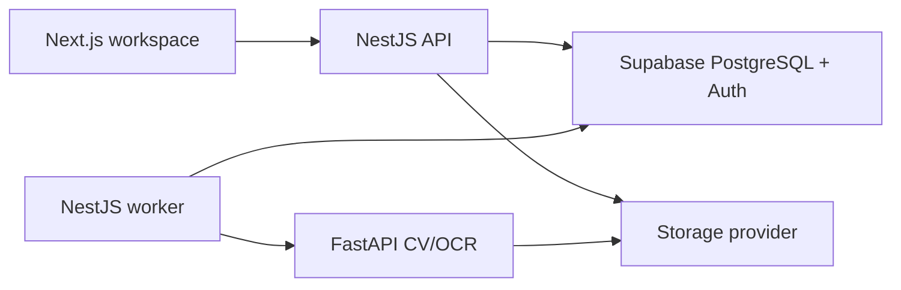

# PlanDelta AI

PlanDelta compares a baseline construction drawing with a revised drawing, aligns the sheets,
detects visual and textual changes, and turns every finding into traceable review evidence.

The product is being built as a serious construction-intelligence workspace—not an estimation claim,
automatic takeoff, or generic analytics dashboard. User-uploaded results will come from a real
deterministic OpenCV/OCR pipeline. The built-in sample is always identified as sample data.

## Current status

The authenticated local product now works from two validated blueprint uploads through durable job
processing, OpenCV alignment and directional differencing, PaddleOCR, normalized evidence regions,
private artifacts, and a deterministic printable report. A clearly labelled precomputed sample
remains available without backend compute. No AWS product resources have been created.

Progress and evidence are recorded in [PHASES.md](./PHASES.md).

## Architecture



- `apps/web`: Next.js App Router interface and blueprint workbench.
- `apps/api`: NestJS HTTP API and separate durable worker entry point.
- `apps/vision`: stateless FastAPI computer-vision and OCR service.
- `packages/contracts`: shared Zod contracts and normalized geometry.
- `packages/ui`: PlanDelta-specific reusable interface utilities.
- `infrastructure`: deployment assets created only after the local release gate.

Supabase PostgreSQL is the source of truth and durable queue. Local development uses a shared
storage volume; production later swaps that provider for private S3. Bedrock summaries remain
optional and never replace deterministic evidence.

## Requirements

- Node.js 22 or newer
- pnpm 11
- Python 3.12
- Supabase project credentials in an ignored `.env.local`
- Docker Desktop for the complete Compose verification path

AWS is not required for local analysis. AWS deployment begins only after the local release gate.

## Setup

```powershell
pnpm install
python -m venv .venv
pnpm vision:install
pnpm db:generate
pnpm db:verify-clean
pnpm db:migrate
pnpm db:seed
```

Copy `.env.example` to `.env.local` and configure values locally. Never commit or paste the
resulting file. The web app runs at `http://localhost:3000`, the API at `http://localhost:4000`, and
the vision service at `http://localhost:8000`. Start the complete non-containerized stack in four
terminals so the API and durable worker remain separate:

```powershell
pnpm --filter @plandelta/vision dev
pnpm --filter @plandelta/api dev
pnpm --filter @plandelta/api dev:worker
pnpm --filter @plandelta/web dev
```

The first OCR analysis may take longer while the configured mobile model initializes. Uploaded files
and generated evidence are written beneath ignored `data/` paths and are never committed.

### Supabase database and authentication

Use the pooled Supabase PostgreSQL URL for `DATABASE_URL` and the direct PostgreSQL URL for
`DIRECT_DATABASE_URL`. For a new empty project, verify and apply the migration chain, then run the
idempotent sample seed:

```powershell
pnpm db:verify-clean
pnpm db:migrate
pnpm db:seed
pnpm db:verify-behavior
```

`db:verify-clean` intentionally refuses to run after PlanDelta tables exist. It executes every
migration inside a rolled-back transaction. `db:verify-behavior` uses temporary synthetic users,
checks cross-user RLS and concurrent queue leasing, and cleans up its records.

In Supabase Auth URL settings, allow `http://localhost:3000/auth/callback` for local passwordless
sign-in. Set `NEXT_PUBLIC_APP_URL` to the matching application origin; add the final Vercel callback
only during deployment.

## Root commands

```text
pnpm dev           Start web, API, and vision development processes
pnpm build         Build every application and shared package
pnpm lint          Run TypeScript and Python lint checks
pnpm typecheck     Run strict TypeScript and Python type checks
pnpm test          Run unit and service tests
pnpm test:e2e      Run browser and service-boundary smoke tests
pnpm verify:local-stack  Run a disposable authenticated upload-to-report integration journey
pnpm verify:local-e2e    Run Playwright against the real API, worker, vision, and Supabase stack
pnpm format        Format supported source and documentation
pnpm db:generate   Generate the Prisma client
pnpm db:verify-clean  Verify migrations transactionally on a new empty project
pnpm db:migrate    Apply committed database migrations
pnpm db:seed       Run the idempotent development seed
pnpm db:verify-behavior  Verify RLS and durable queue behavior
pnpm docker:up     Build and start local service containers
pnpm docker:down   Stop local service containers
```

### Troubleshooting

- If an app port is busy, stop only the process you own or configure another port; PlanDelta's
  browser tests intentionally use port 3100 and do not reuse an existing server.
- `NEXT_PUBLIC_API_URL` may be the API origin (`http://localhost:4000`) or include `/v1`; the web
  client normalizes it once.
- A failed analysis remains visible with its safe error message and can be retried from the progress
  screen. Polling continues when Supabase Realtime is unavailable.
- On Windows, container-style `/data` configuration is normalized to the repository's ignored
  `data/` directory for local processes.
- Docker Compose verification requires Docker Desktop. The non-containerized integration and live
  Playwright harnesses exercise the same API, worker, vision, database, Auth, and storage workflow.

## Safety and limitations

- PlanDelta supports revision review; it does not guarantee quantities, cost, constructability, or
  code compliance.
- Uploaded drawings are private runtime data and never training material.
- Low-confidence alignment or OCR remains visibly uncertain.
- Public demos use labelled sample evidence when temporary backend compute is unavailable.

See [PLAN.md](./PLAN.md), [docs/ARCHITECTURE.md](./docs/ARCHITECTURE.md), and
[docs/SECURITY.md](./docs/SECURITY.md) for the complete engineering contract.
