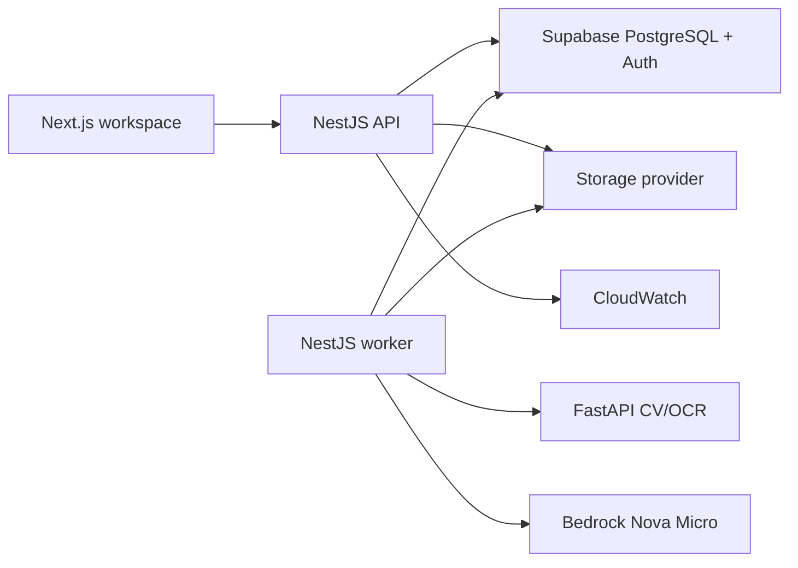

# PlanDelta AI

PlanDelta compares a baseline construction drawing with a revised drawing, aligns the sheets,
detects visual and textual changes, and turns every finding into traceable review evidence.

The product is a serious construction-intelligence workspace—not an estimation claim, automatic
takeoff, or generic analytics dashboard. User-uploaded results come from a real deterministic
OpenCV/OCR pipeline. The built-in sample is always identified as sample data.

## Current status

The product is verified locally and on its cost-controlled AWS runtime from two validated blueprint
uploads through durable job processing, OpenCV alignment and directional differencing, PaddleOCR,
normalized evidence regions, private S3 artifacts, an evidence-constrained Bedrock summary, and a
printable report. One `t3.small`, one worker, and the public HTTPS API are live with budget alerts
and a USD 25 teardown gate.

The [public Vercel workspace](https://plandelta-ai.vercel.app) has verified passwordless sign-in and
live uploads connected to the AWS runtime. The production journey has completed from two uploaded
drawings through private storage, deterministic analysis, evidence review, and report generation.
The clearly labelled sample remains available without signing in and will remain useful if the
temporary AWS compute is later stopped.

Progress and evidence are recorded in [PHASES.md](./PHASES.md).

## Product


The workspace keeps the built-in example visibly separate from user uploads and shows the evidence
count before a reviewer opens the comparison.


The review surface presents the original baseline and revised drawings together, links change
markers to the evidence ledger, and keeps confidence and affected work visible without presenting a
result as automatic approval.

## Architecture



- `apps/web`: Next.js App Router interface and blueprint workbench.
- `apps/api`: NestJS HTTP API and separate durable worker entry point.
- `apps/vision`: stateless FastAPI computer-vision and OCR service.
- `packages/contracts`: shared Zod contracts and normalized geometry.
- `packages/ui`: PlanDelta-specific reusable interface utilities.
- `infrastructure`: deployment assets created only after the local release gate.

Supabase PostgreSQL is the source of truth and durable queue. Local development uses a shared
storage volume; the verified production provider uses private S3. Bedrock summaries remain optional
and never replace deterministic evidence.

Production uses one encrypted 20 GB `t3.small` with 2 GB swap, IMDSv2, standard T3 credits, SSM-only
administration, ports 80/443, one concurrency-one worker, and seven-day logs. It does not use a NAT
Gateway, load balancer, RDS, cache, cluster, or provisioned Bedrock capacity.

The public API applies strict input validation, security headers, request timeouts, per-IP traffic
limits, and database-backed per-user upload and analysis quotas. Readiness checks cover PostgreSQL
and the vision service; structured logs use correlation IDs without recording tokens, drawing
content, or OCR text. Defaults, cleanup behavior, and incident checks are documented in
[docs/OPERATIONS.md](./docs/OPERATIONS.md).

## Verified evidence

| Gate                     | Recorded result                                                                      |
| ------------------------ | ------------------------------------------------------------------------------------ |
| Unit suites              | 3 contract, 9 web, 41 API, and 27 vision tests                                       |
| Deployed analysis        | 1 real CV/OCR change, 7 private artifacts, Bedrock report, cleanup passed            |
| Recovery                 | API restart recovered; natural 3/3 job failure completed through the real retry path |
| ONNX synthetic benchmark | 1.000 macro-F1 versus 0.667 rules; 0.1697 ms single-crop CPU p95                     |
| AWS billing snapshot     | USD 0.00 actual/estimated at capture; alerts at USD 10/15/20/25                      |

The ONNX numbers use a seed-generated synthetic validation set and are not field-accuracy claims.
Billing data can lag resource use. Full commands, caveats, and evidence are recorded in
[docs/RELEASE.md](./docs/RELEASE.md), [docs/MODEL_CARD.md](./docs/MODEL_CARD.md), and
[docs/AWS_COSTS.md](./docs/AWS_COSTS.md).

## Requirements

- Node.js 22 or newer
- pnpm 11
- Python 3.12
- Supabase project credentials in an ignored `.env.local`
- Docker Desktop for the complete Compose verification path

AWS is not required for local analysis. AWS deployment begins only after the local release gate.

## Setup

```powershell
pnpm install
python -m venv .venv
pnpm vision:install
pnpm db:generate
pnpm db:verify-clean
pnpm db:migrate
pnpm db:seed
```

Copy `.env.example` to `.env.local` and configure values locally. Never commit or paste the
resulting file. The web app runs at `http://localhost:3000`, the API at `http://localhost:4000`, and
the vision service at `http://localhost:8000`. Start the complete non-containerized stack in four
terminals so the API and durable worker remain separate:

```powershell
pnpm --filter @plandelta/vision dev
pnpm --filter @plandelta/api dev
pnpm --filter @plandelta/api dev:worker
pnpm --filter @plandelta/web dev
```

The first OCR analysis may take longer while the configured mobile model initializes. Uploaded files
and generated evidence are written beneath ignored `data/` paths and are never committed.

After a production build, the same four-process stack can be started and stopped as one managed
command:

```powershell
pnpm build
pnpm start:local
```

Press `Ctrl+C` in that terminal to stop only the PlanDelta processes started by the command.

### Supabase database and authentication

Use the pooled Supabase PostgreSQL URL for `DATABASE_URL` and the direct PostgreSQL URL for
`DIRECT_DATABASE_URL`. For a new empty project, verify and apply the migration chain, then run the
idempotent sample seed:

```powershell
pnpm db:verify-clean
pnpm db:migrate
pnpm db:seed
pnpm db:verify-behavior
```

`db:verify-clean` intentionally refuses to run after PlanDelta tables exist. It executes every
migration inside a rolled-back transaction. `db:verify-behavior` uses temporary synthetic users,
checks cross-user RLS and concurrent queue leasing, and cleans up its records.

In Supabase Auth URL settings, allow `http://localhost:3000/auth/callback` for local passwordless
sign-in. Set `NEXT_PUBLIC_APP_URL` to the matching application origin; add the final Vercel callback
`https://plandelta-ai.vercel.app/auth/callback` during deployment.

## Root commands

```text
pnpm dev           Start web, API, and vision development processes
pnpm build         Build every application and shared package
pnpm lint          Run TypeScript and Python lint checks
pnpm typecheck     Run strict TypeScript and Python type checks
pnpm test          Run unit and service tests
pnpm test:e2e      Run browser and service-boundary smoke tests
pnpm verify:local-stack  Run a disposable authenticated upload-to-report integration journey
pnpm verify:local-e2e    Run Playwright against the real API, worker, vision, and Supabase stack
pnpm start:local    Start the built web, API, worker, and vision stack until Ctrl+C
pnpm format        Format supported source and documentation
pnpm db:generate   Generate the Prisma client
pnpm db:verify-clean  Verify migrations transactionally on a new empty project
pnpm db:migrate    Apply committed database migrations
pnpm db:seed       Run the idempotent development seed
pnpm db:verify-behavior  Verify RLS and durable queue behavior
pnpm docker:up     Build and start local service containers
pnpm docker:down   Stop local service containers
```

### Troubleshooting

- If an app port is busy, stop only the process you own or configure another port. Browser tests use
  an isolated Next build directory on port 3100, so they do not disturb the development server on
  port 3000.
- `NEXT_PUBLIC_API_URL` may be the API origin (`http://localhost:4000`) or include `/v1`; the web
  client normalizes it once.
- A failed analysis remains visible with its safe error message and can be retried from the progress
  screen. Polling continues when Supabase Realtime is unavailable.
- On Windows, container-style `/data` configuration is normalized to the repository's ignored
  `data/` directory for local processes.
- Docker Compose verification requires Docker Desktop. The non-containerized integration and live
  Playwright harnesses exercise the same API, worker, vision, database, Auth, and storage workflow.

## Safety and limitations

- PlanDelta supports revision review; it does not guarantee quantities, cost, constructability, or
  code compliance.
- Uploaded drawings are private runtime data and never training material.
- Low-confidence alignment or OCR remains visibly uncertain.
- The small ONNX changed-region classifier is confidence-gated and falls back visibly to
  deterministic rules; its published metrics are synthetic-set measurements, not real-world
  accuracy.
- Public demos use labelled sample evidence when temporary backend compute is unavailable.

See [PLAN.md](./PLAN.md), [docs/ARCHITECTURE.md](./docs/ARCHITECTURE.md), and
[docs/SECURITY.md](./docs/SECURITY.md) for the complete engineering contract. API examples and
operational limits are documented in [docs/OPERATIONS.md](./docs/OPERATIONS.md). Classifier scope,
reproduction, measured metrics, and limitations are recorded in
[docs/MODEL_CARD.md](./docs/MODEL_CARD.md). The current local gate and accepted base-image findings
are recorded in [docs/RELEASE.md](./docs/RELEASE.md). Portfolio-ready resume bullets, interview
talking points, and the verified cloud story are in [docs/PORTFOLIO.md](./docs/PORTFOLIO.md).
