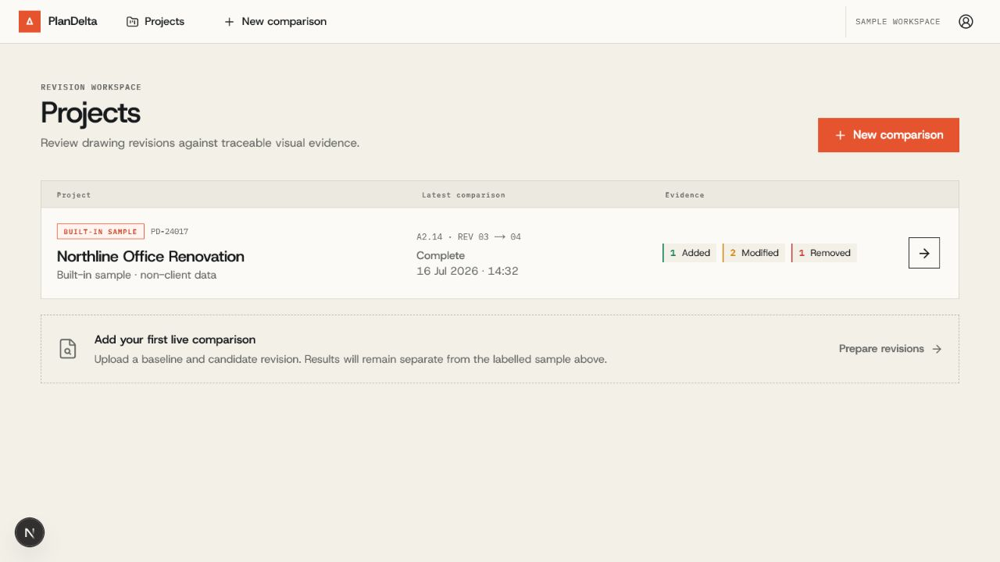
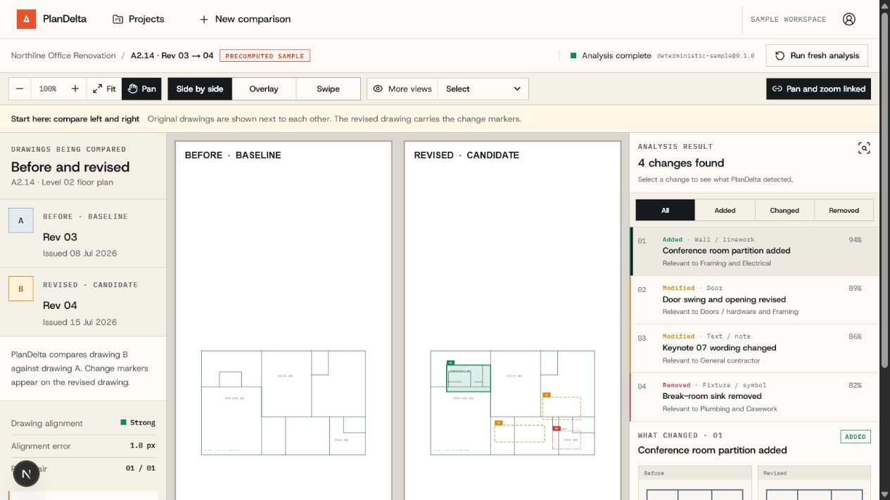
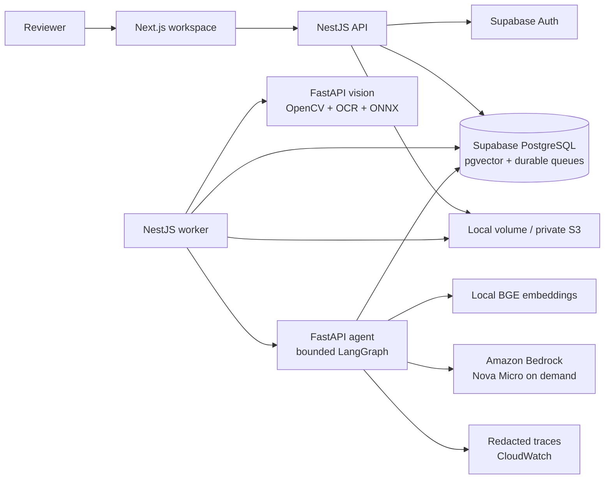

<h1 align="center">PlanDelta AI</h1>

<p align="center"><strong>Evidence-first intelligence for construction drawing revisions.</strong></p>

<p align="center">
  <a href="https://github.com/abdullahahsen05/plandelta-ai/releases/tag/v0.2.0"></a>
  <a href="https://github.com/abdullahahsen05/plandelta-ai/releases/tag/v0.2.0"></a>
  <a href="https://github.com/abdullahahsen05/plandelta-ai/actions/workflows/ci.yml"></a>
  <a href="./LICENSE"></a>
  <a href="https://plandelta-ai.vercel.app"></a>
  <br>
  
  
  
  
  
  <br>
  
  
  
  
  
  
</p>

PlanDelta aligns a baseline drawing with a revised drawing, detects visual and textual changes, and
turns each finding into inspectable review evidence. Its Evidence Copilot answers project questions
from authorized drawing regions and supporting documents, with interactive citations and
human-review-only RFI drafts.

This is a working, full-stack construction-intelligence product—not a generic chatbot, automatic
takeoff system, or collection of hardcoded AI results. Uploaded drawings run through a deterministic
OpenCV/OCR pipeline. Built-in demonstrations are always labelled as sample data.

## Explore the product

| Journey                                                                                       | What it demonstrates                                                                                |
| --------------------------------------------------------------------------------------------- | --------------------------------------------------------------------------------------------------- |
| [Construction sample](https://plandelta-ai.vercel.app/app/analyses/sample)                    | Linked drawing evidence, change ledger, side-by-side comparison, and printable reporting            |
| [Engineering schematic sample](https://plandelta-ai.vercel.app/app/analyses/schematic-sample) | Three schematic changes, cited Evidence Copilot answer, and citation-to-ledger navigation           |
| [Live workspace](https://plandelta-ai.vercel.app/app)                                         | No-sign-in guest access, isolated projects, real uploads, durable processing, and project knowledge |

For a live comparison:

1. Open the workspace; PlanDelta creates an isolated guest session automatically.
2. Create a project and upload the earlier drawing as the **baseline**.
3. Upload the later drawing as the **candidate**.
4. Start analysis and review the aligned sheets beside the change ledger.
5. Select evidence regions, ask grounded questions, inspect citations, and print the report.

Accepted drawing formats are PDF, PNG, JPG, and JPEG. Default limits are 20 MB per file, 50 PDF
pages per drawing, and one selected page from each revision per analysis.

## Product experience



Projects keep sample data visibly separate from user uploads and expose analysis state without fake
analytics or invented findings.



The comparison workbench preserves the source drawings, links canvas markers to evidence, supports
side-by-side and overlay inspection, and keeps uncertainty visible.

## What is implemented

### Deterministic revision analysis

- PDF and image ingestion with MIME, size, page-count, and pixel validation
- sheet rasterization, alignment, reprojection measurement, and directional differencing
- PaddleOCR text comparison and normalized evidence coordinates
- confidence-gated ONNX region classification with an explicit deterministic fallback
- durable PostgreSQL jobs, leases, retries, heartbeats, and stale-work recovery
- private source drawings, crops, overlays, and signed artifact access
- evidence-ledger filtering, synchronized viewer focus, and printable reports

### Evidence Copilot

- durable project conversations and resumable run events
- local `BAAI/bge-small-en-v1.5` embeddings
- Supabase pgvector and PostgreSQL full-text hybrid retrieval
- versioned supporting-document extraction, chunking, supersession, and conflict handling
- bounded LangGraph supervisor with visual, knowledge, and impact specialists
- allowlisted typed tools with server-owned project and analysis scope
- claim verification, citation validation, one bounded repair, and safe fallback
- interactive drawing-region and document citations
- editable RFI drafts that cannot be sent automatically
- prompt-injection resistance, cancellation, time, tool, token, and cost budgets

### Production controls

- Supabase Auth, PostgreSQL row-level security, and project ownership checks
- per-user upload, analysis, message, concurrency, token, and estimated-cost quotas
- correlation-aware structured logging with prompt, answer, OCR, and drawing content redacted
- API security headers, request timeouts, strict DTO validation, and traffic limits
- health and readiness checks across PostgreSQL, agent, and vision dependencies
- one-worker and one-agent-run concurrency on the deployed portfolio runtime

## Architecture



The browser never calls the agent, S3, Bedrock, or service-role database paths directly. PostgreSQL
is the system of record for ownership, analysis jobs, ingestion jobs, conversations, agent runs,
citations, and traces. Bedrock can synthesize an evidence-grounded response, but it cannot create or
replace deterministic drawing evidence.

### Repository layout

```text
apps/
  web/          Next.js App Router workspace
  api/          NestJS API and separate durable worker
  vision/       Stateless FastAPI CV/OCR service
  agent/        FastAPI ingestion, hybrid RAG, agent graph, guardrails, and evaluations
packages/
  contracts/    Shared Zod contracts and normalized geometry
  ui/           Shared PlanDelta interface utilities
infrastructure/
  aws/          Cost guard, storage, ECR, runtime, and verification automation
  runtime/      Production Compose and recovery scripts
samples/        Labelled construction, schematic, and knowledge fixtures
docs/           Architecture, API, operations, security, testing, costs, and release evidence
```

Read [the complete v0.2 architecture](./docs/ARCHITECTURE_V0_2.md) for graph state, tool boundaries,
reliability rules, and request sequences.

## Verified release evidence

Version [`v0.2.0`](https://github.com/abdullahahsen05/plandelta-ai/releases/tag/v0.2.0) was released
on 2026-07-19 after the complete local, CI, database, container, and production verification matrix
passed.

| Gate                       | Recorded result                                                                                            |
| -------------------------- | ---------------------------------------------------------------------------------------------------------- |
| Unit and service suites    | 66 agent, 56 API, 32 vision, 15 web, and 8 contract tests                                                  |
| Provider integrations      | Real Supabase RAG and two separately enabled AWS provider tests passed                                     |
| Frozen agent evaluation    | 30/30 cases; 100% citation, routing, conflict, and refusal metrics; zero injection overrides               |
| Production drawing journey | Authentication, upload, CV/OCR/ONNX evidence, private artifacts, report, and cleanup passed                |
| Production RAG journey     | Document ingestion, local embeddings, hybrid retrieval, Bedrock, verified citation/RFI, and cleanup passed |
| Browser release journey    | Real upload-to-report Playwright journey passed in 46.5 seconds                                            |
| Runtime capacity           | Five services healthy on one `t3.small`; 885 MB available; agent approximately 87 MB idle                  |
| Observability              | All nine CloudWatch alarms `OK`; all five service log streams present                                      |
| Security                   | Full-history Gitleaks scan passed; dependency audits found no published vulnerability                      |
| Billing snapshot           | AWS Budget actual USD 0.589 against the USD 25 teardown gate                                               |

These measurements are reproducible release evidence, not field-accuracy claims. The ONNX validation
set is synthetic, and AWS billing can lag resource use. See
[application evidence](./docs/APPLICATION_EVIDENCE_V0_2.md), [release evidence](./docs/RELEASE.md),
[evaluation results](./docs/EVALS_V0_2.md), and the [model card](./docs/MODEL_CARD.md).

## Local development

### Prerequisites

- Node.js 22 or newer
- pnpm 11
- Python 3.12
- Docker Desktop for the complete Compose path
- a Supabase project with PostgreSQL, Auth, and pgvector
- AWS only for optional Bedrock/S3 integration and cloud deployment

### Configure the environment

Copy `.env.example` to the ignored `.env.local` file and configure the documented variables there.
Never commit the resulting file or paste credentials into issues, pull requests, or chat.

For Supabase:

- use the pooled PostgreSQL connection for `DATABASE_URL`;
- use the direct PostgreSQL connection for `DIRECT_DATABASE_URL`;
- allow `http://localhost:3000/auth/callback` in Auth redirect URLs;
- set `NEXT_PUBLIC_APP_URL=http://localhost:3000`.

Generate separate long random values for `INTERNAL_SERVICE_SECRET` and `AGENT_INTERNAL_TOKEN`. Local
deterministic drawing analysis does not require AWS.

### Install and prepare the database

```powershell
pnpm install
python -m venv .venv
pnpm vision:install
pnpm agent:install
pnpm db:generate
pnpm db:verify-clean
pnpm db:migrate
pnpm db:seed
pnpm db:verify-behavior
```

`db:verify-clean` replays every migration inside a rolled-back transaction and intentionally refuses
to run against a database that already contains PlanDelta tables. `db:verify-behavior` creates and
removes synthetic records while testing RLS, project isolation, leases, concurrency, stale recovery,
and agentic queue behavior.

### Start the development stack

Run the services in separate terminals:

```powershell
pnpm --filter @plandelta/vision dev
pnpm --filter @plandelta/agent dev
pnpm --filter @plandelta/api dev
pnpm --filter @plandelta/api dev:worker
pnpm --filter @plandelta/web dev
```

| Service              | Local address           |
| -------------------- | ----------------------- |
| Web                  | `http://localhost:3000` |
| API                  | `http://localhost:4000` |
| Vision               | `http://localhost:8000` |
| Agent, internal only | `http://localhost:8100` |

The first OCR or embedding operation can take longer while local models initialize. Runtime uploads,
generated artifacts, virtual environments, caches, and model downloads remain ignored by Git.

For the production-built local stack:

```powershell
pnpm build
pnpm start:local
```

Press `Ctrl+C` to stop only the PlanDelta processes started by that command.

## Quality gates

```powershell
pnpm format:check
pnpm lint
pnpm typecheck
pnpm test
pnpm test:e2e
pnpm build
```

Additional end-to-end and agentic verification:

```powershell
pnpm verify:local-stack
pnpm verify:local-e2e
pnpm verify:local-agentic
pnpm --filter @plandelta/agent eval:release
```

Browser tests use an isolated Next.js build on port 3100 and do not disturb a development server on
port 3000. Real provider checks are explicit opt-in gates and never silently substitute fake
analysis or fake model output. The full matrix is documented in
[FINAL_VERIFICATION_V0_2.md](./docs/FINAL_VERIFICATION_V0_2.md).

## Deployment and cost boundaries

The public frontend runs on Vercel. The verified backend uses:

- one `t3.small` EC2 instance;
- one encrypted 20 GB `gp3` volume;
- private ECR repositories for API, vision, and agent images;
- private S3 storage for runtime artifacts;
- Systems Manager for administration and encrypted runtime configuration;
- CloudWatch logs, metrics, and alarms;
- on-demand Amazon Nova Micro through Bedrock.

The design deliberately excludes NAT Gateway, load balancers, RDS, ElastiCache, OpenSearch,
SageMaker endpoints, Kubernetes, ECS/Fargate, and provisioned Bedrock capacity. A conservative
always-on estimate is USD 22.94 per month before credits or free allowances. Gross-cost alerts exist
at USD 10, 15, 20, and 25; the USD 25 teardown gate remains binding.

See [AWS costs](./docs/AWS_COSTS.md), [operations](./docs/OPERATIONS.md), and
[deployment guidance](./docs/DEPLOYMENT.md) before creating or retaining cloud resources.

## Security and data handling

- uploaded drawings and supporting documents are private runtime data, not training material;
- secrets and service credentials remain server-side and outside Git;
- authorization scope comes from the authenticated server context, never model output;
- document and OCR content is treated as untrusted data, including prompt-injection attempts;
- citations are authorized and validated before an answer can complete;
- model traces store bounded structured events, not hidden reasoning or raw project content;
- RFIs remain editable drafts with no external send action.

Please report security concerns through the process in [docs/SECURITY.md](./docs/SECURITY.md), not a
public issue.

## Scope and limitations

- PlanDelta supports revision review; it does not approve drawings or guarantee quantities, cost,
  constructability, structural adequacy, or code compliance.
- The MVP compares one selected page from two drawing revisions.
- Low-confidence alignment, OCR, classification, and retrieval remain visibly uncertain.
- RAG can miss ambiguous or poorly extracted source text; stale and conflicting sources require
  human judgment.
- Construction-drawing and engineering-schematic profiles do not imply arbitrary-image support.
- Evaluation and synthetic classifier metrics are regression signals, not real-world accuracy.
- Live processing depends on the retained Supabase and AWS services. Labelled samples remain usable
  if temporary compute is stopped.

Every finding, citation, impact statement, and RFI draft must be checked against the source material
by a qualified reviewer before coordination, procurement, or construction.

## Documentation

| Area                     | Reference                                                                                         |
| ------------------------ | ------------------------------------------------------------------------------------------------- |
| New-agent handoff        | [Start here](./HANDOFF.md) · [current state](./docs/HANDOFF/CURRENT_STATE.md)                     |
| Product and phase record | [Plan](./PLAN_AGENTIC_V0_2.md) · [Phases](./PHASES_AGENTIC_V0_2.md)                               |
| Architecture             | [v0.2 architecture](./docs/ARCHITECTURE_V0_2.md) · [system architecture](./docs/ARCHITECTURE.md)  |
| API and chat contracts   | [API contract](./docs/API_CONTRACT.md) · [chat API](./docs/API_CHAT_V0_2.md)                      |
| Database and retrieval   | [Database RAG](./docs/DATABASE_RAG_V0_2.md)                                                       |
| Guardrails and UX        | [Guardrails](./docs/GUARDRAILS_V0_2.md) · [chat UX](./docs/CHAT_UX_V0_2.md)                       |
| Testing and evaluation   | [Testing](./docs/TESTING.md) · [evaluations](./docs/EVALS_V0_2.md)                                |
| Operations and security  | [Operations](./docs/OPERATIONS.md) · [security](./docs/SECURITY.md)                               |
| Deployment and cost      | [Deployment](./docs/DEPLOYMENT.md) · [AWS costs](./docs/AWS_COSTS.md)                             |
| Evidence and release     | [Application evidence](./docs/APPLICATION_EVIDENCE_V0_2.md) · [release record](./docs/RELEASE.md) |

## License

PlanDelta AI is available under the [MIT License](./LICENSE).
