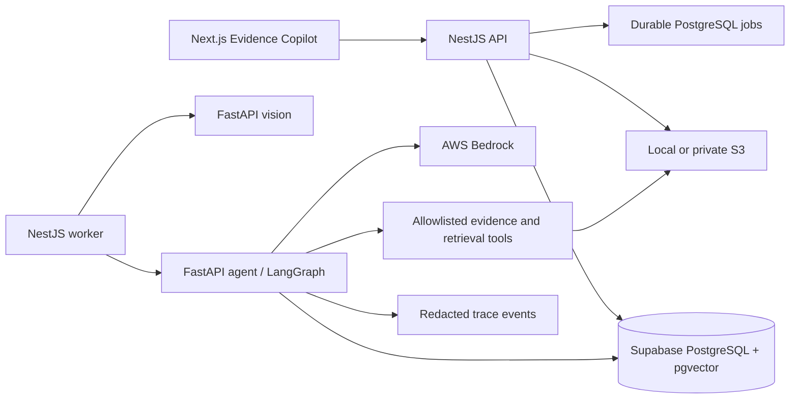
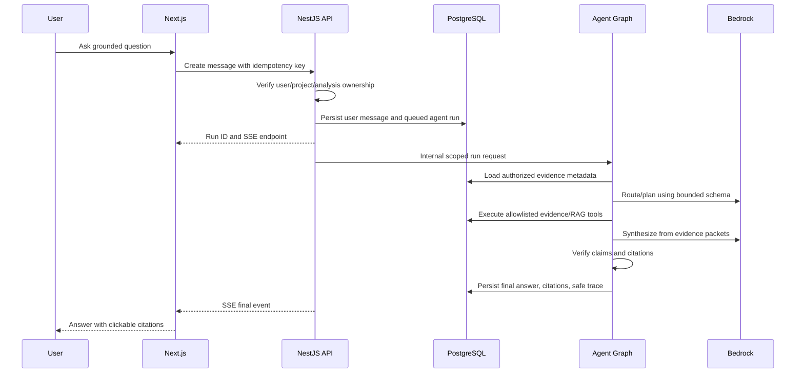
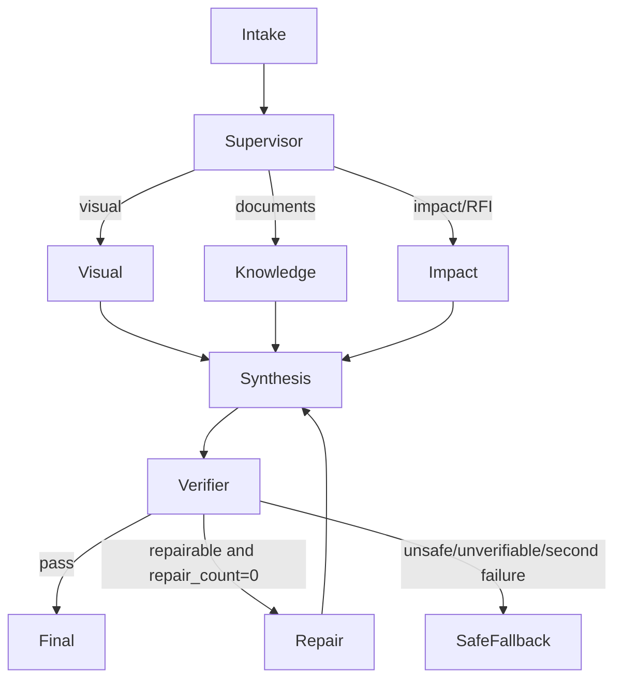

# Agentic Architecture v0.2

## Runtime topology



The browser never calls `apps/agent`, S3, Bedrock, or service-role database
paths directly.

## Repository additions

```text
apps/agent/
  plandelta_agent/
    main.py
    config.py
    auth.py
    graph/
      state.py
      workflow.py
      routing.py
      nodes.py
    agents/
      supervisor.py
      visual_evidence.py
      knowledge.py
      impact.py
      verifier.py
    tools/
      registry.py
      changes.py
      artifacts.py
      retrieval.py
      quantity.py
      documents.py
    rag/
      extract.py
      chunk.py
      embeddings.py
      hybrid_search.py
      conflicts.py
    providers/
      chat.py
      bedrock_chat.py
      fake_chat.py
      embeddings.py
      local_embeddings.py
    guardrails/
      input_policy.py
      tool_policy.py
      citation_policy.py
      budgets.py
    observability/
      events.py
      metrics.py
      redaction.py
    models/
      requests.py
      evidence.py
      answers.py
      traces.py
  tests/
  evals/

apps/api/src/
  knowledge/
  conversations/
  agent-runs/

apps/web/
  components/evidence-copilot/

packages/contracts/src/
  chat/
  knowledge/
  agent/
  profiles/
```

Exact module names may follow existing repository conventions, but the final
source must keep orchestration, state, tools, retrieval, guardrails,
observability, and evaluations easy to identify.

## Request and run sequence



## Typed graph state

The graph state must include only explicit serializable fields such as:

```text
run_id
conversation_id
user_id
project_id
analysis_id
analysis_profile
question
intent
selected_specialists
evidence_packets
candidate_answer
verifier_result
repair_count
tool_call_count
model_turn_count
retrieved_chunk_count
token_usage
estimated_cost_usd
deadline_at
cancellation_requested
safe_errors
```

Do not persist free-form hidden reasoning. Store structured decisions such as
`selected_specialists=[visual,knowledge]` and `reason_code=QUESTION_NEEDS_SPEC`,
not chain-of-thought.

## Graph routing



Supervisor output must be schema constrained. It cannot invent new tools or
specialist names.

## Tool boundary

Every tool definition includes:

- stable name and version;
- typed input/output schemas;
- allowed specialist roles;
- project/analysis scope derivation;
- maximum rows/bytes/pages;
- timeout and cancellation behavior;
- safe error codes;
- logging/redaction policy.

The LLM never provides `user_id` or chooses an authorization scope. Those
values come from the server-created run context.

## Reliability

- Agent run creation is idempotent on user message plus client key.
- Durable states are `QUEUED`, `RUNNING`, `VERIFYING`, `COMPLETED`, `FAILED`,
  `CANCELLED`, and `EXPIRED` or equivalent.
- Lease and heartbeat semantics follow the existing analysis worker.
- Retried runs reuse the original user message but create a new attempt/run
  record linked to it.
- Final message and citations persist in one transaction.
- A run cannot publish a final answer before all citations validate.
- SSE is resumable from persisted event sequence numbers or reconstructs the
  current state after reconnect.

## Deployment

Deploy the agent as a fifth lightweight container on the existing EC2 only
after measuring current capacity. Use concurrency one, memory limits, lazy local
embedding loading, short timeouts, and the existing reverse-proxy/internal
network pattern. Do not expose the agent port publicly.
