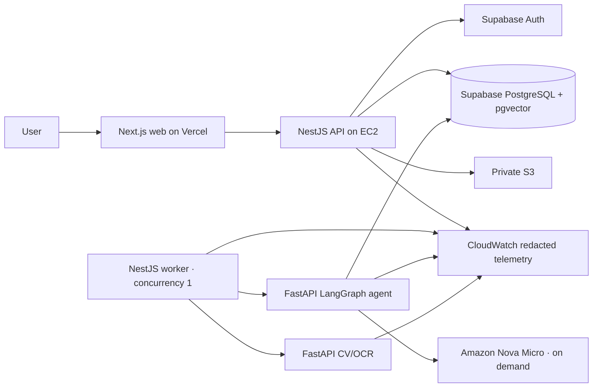

# PlanDelta System Map

## Runtime topology

Production uses one `t3.small`, 20 GB encrypted gp3, a private S3 bucket, three private ECR
repositories, SSM, CloudWatch, Bedrock on demand, Supabase, and Vercel. There is no load balancer,
NAT Gateway, RDS, Redis, OpenSearch, SageMaker endpoint, ECS/Fargate, or Kubernetes.

## Repository ownership

| Path | Responsibility |
| --- | --- |
| `apps/web` | Next.js UI, authenticated project workflows, drawing viewer, evidence register, Copilot client |
| `apps/api` | NestJS authorization boundary, storage API, durable queues, SSE, citation resolution |
| `apps/vision` | Stateless deterministic rendering, alignment, CV, OCR, ONNX classification |
| `apps/agent` | Typed ingestion, local embeddings, hybrid retrieval, bounded LangGraph workflow, verifier |
| `packages/contracts` | Shared Zod/API/profile contracts |
| `infrastructure/aws` | Budget, S3/IAM, ECR, EC2/SSM/CloudWatch CloudFormation and verifiers |
| `infrastructure/runtime` | Production Compose, reverse proxy, immutable refresh logic |
| `scripts` | Local integration, journey verification, model/data helpers, deployment utilities |
| `samples` | Labelled construction/schematic and knowledge fixtures; never present samples as user results |

## Load-bearing request paths

### Drawing comparison

1. `apps/web/components/upload-comparison-form.tsx` creates a project, queues selected supporting
   documents, uploads both revisions, and starts an analysis. It cleans partial resources after a
   failed setup.
2. `apps/api/src/revisions` validates signatures, size/page limits, ownership, and private storage.
3. `apps/api/src/analyses` owns the durable analysis job and cancellation/retry behavior.
4. `apps/api/src/worker` leases jobs and calls `apps/vision`.
5. `apps/vision/plandelta_vision` renders/alines pages, computes deterministic differences, runs
   bounded OCR/classification, and returns normalized evidence.
6. `apps/web/components/workbench.tsx`, `blueprint-canvas.tsx`, and `change-ledger.tsx` render the
   linked source comparison and numbered evidence.

### Project-document RAG

1. `apps/web/components/knowledge-register.tsx` uploads, lists, versions, retries, deletes, and opens
   the authorized source. The same register appears on the project page and in the workbench drawer.
2. `apps/api/src/knowledge/knowledge-documents.controller.ts` and
   `knowledge-documents.service.ts` validate project ownership, MIME/signature/size, storage, and
   ingestion jobs.
3. `apps/agent/plandelta_agent/ingestion/processor.py` coordinates extraction, structural chunking,
   local embedding, and atomic activation.
4. `ingestion/extraction.py`, `chunking.py`, `storage.py`, and `vision_ocr.py` are the bounded source
   adapters.
5. `providers/local_embeddings.py` uses the CPU-sensible BGE small model.
6. `ingestion/repository.py` persists chunks/version state; `retrieval.py` executes project-scoped
   PostgreSQL full-text plus pgvector hybrid retrieval.
7. Database functions and RLS live in versioned migrations under `apps/api/prisma/migrations`.

### Evidence Copilot

1. `apps/web/components/evidence-copilot/evidence-copilot.tsx` creates messages, follows durable SSE,
   renders state/refusals, and turns citations into source navigation.
2. `apps/api/src/agentic/conversations.service.ts` authorizes the project/analysis and creates the
   durable message/run with idempotency and quotas.
3. `apps/api/src/agentic/agentic-queue.service.ts` leases ingestion/agent work; the worker invokes
   only the internal authenticated agent endpoint.
4. `apps/agent/plandelta_agent/agents/supervisor.py` chooses visual, knowledge, and/or impact
   specialists from a fixed typed enum.
5. `agents/specialists.py` gives each specialist distinct tool permissions.
6. `tools/registry.py` enforces schemas, scope, role, time/result limits, and duplicate-call policy;
   `tools/implementations.py` contains the load-bearing database/retrieval tools.
7. `graph/workflow.py` builds the actual LangGraph route, synthesis, verifier, one repair pass, and
   safe terminal fallback.
8. `graph/verifier.py` rejects missing, invented, stale, cross-project, geometrically invalid, and
   one-sided conflict citations.
9. `graph/persistence.py` and `apps/api/src/agentic/agent-run-finalizer.service.ts` persist steps,
   outcome, usage, final message, and verified citations.
10. `apps/api/src/agentic/citations.service.ts` resolves only authorized visual/document sources.

## State and data model

Supabase PostgreSQL is the system of record. Important tables include projects, revisions, analyses,
changes, artifacts, reports, knowledge documents/versions/chunks, ingestion jobs, conversations,
messages, agent runs/steps/events, and citations. Queue claims use leases/heartbeats and are
recoverable after worker restarts. RLS and application ownership checks are both required.

Knowledge records preserve checksum, source MIME/name, document type, revision/effective date,
parser/chunker/embedding versions, page/section location, active/superseded state, and conflicts.
Failed extraction/embedding is explicit and not searchable. Normal retrieval excludes stale
versions. Explicit historical conflict retrieval must name a revision and returns both sides marked
as conflicting.

## Guardrails and failure behavior

| Concern | Load-bearing implementation | Required behavior |
| --- | --- | --- |
| Prompt injection | `guardrails/input_policy.py` | Treat instruction-like OCR/document text as quoted evidence |
| Cost/tool loops | `guardrails/budgets.py`, `tools/registry.py` | Cap turns, unique calls, chunks, tokens, time, cost; reject duplicates |
| Unsupported claims | `graph/verifier.py` | One repair maximum, then deterministic insufficient-evidence fallback |
| Conflicts/stale data | `ingestion/repository.py`, verifier | Never silently prefer stale evidence; cite both sides of a conflict |
| Cross-project access | API ownership checks, RLS, server-owned run context | Deny without revealing existence |
| Provider outage | providers + workflow fallback | Preserve deterministic evidence; no fabricated AI success |
| Cancellation/restart | durable queues, SSE event persistence | Resume/reconstruct state and terminate bounded work |
| Logging privacy | `apps/agent/plandelta_agent/telemetry.py` | Log IDs, counters, durations, safe codes—not prompts/chunks/tokens/URLs |

## Test and evaluation map

- Web unit/integration: `apps/web/test`; browser journeys: `apps/web/e2e`.
- API service/security/queue tests: colocated `*.spec.ts` under `apps/api/src`.
- Vision deterministic tests: `apps/vision/tests`.
- Agent routing/tools/guardrails/verifier/ingestion: `apps/agent/tests`.
- Real Supabase ingestion/pgvector check: `apps/agent/tests/test_rag_database_integration.py`.
- Frozen safety/routing evaluation data: `apps/agent/evals/datasets/release-v0.2.jsonl` and
  `thresholds-v0.2.json`.
- Final verification requirements: `docs/FINAL_VERIFICATION_V0_2.md`.

